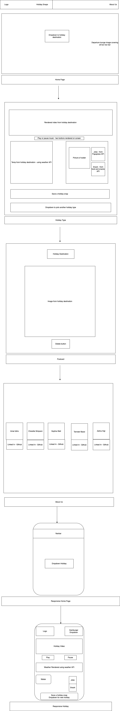
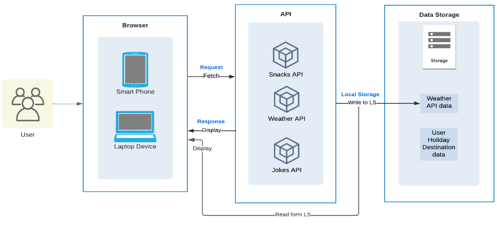
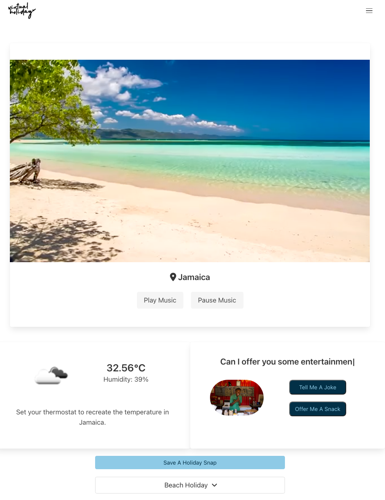
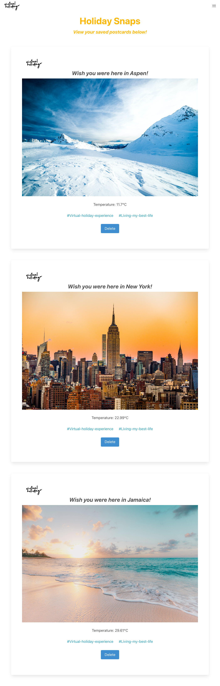
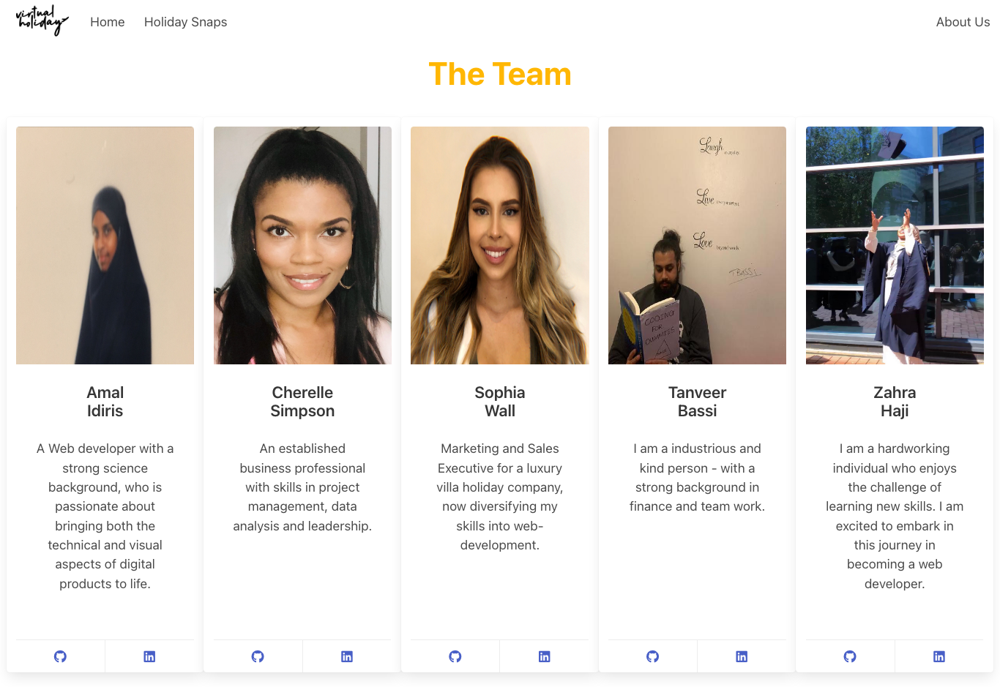
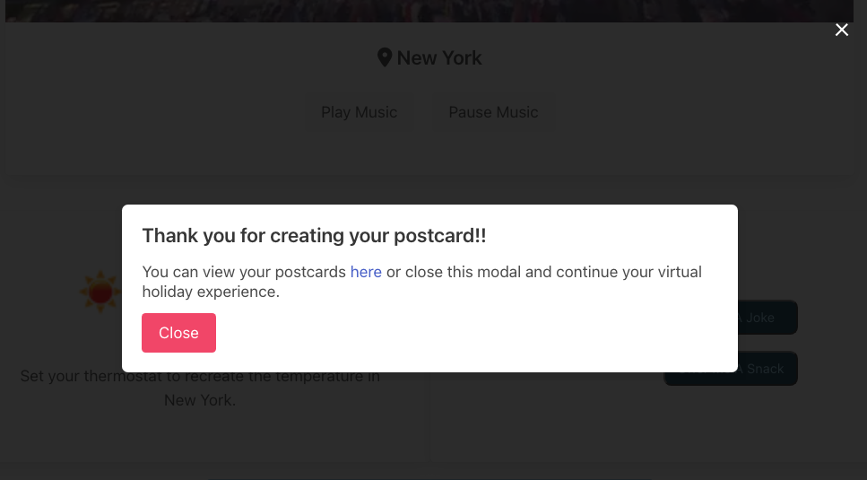
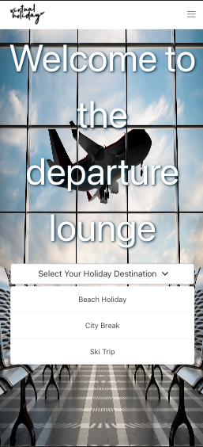
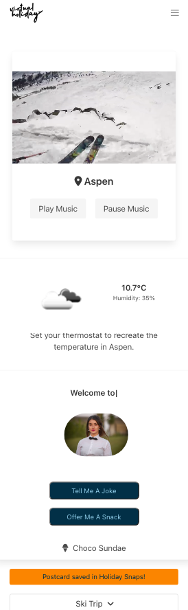
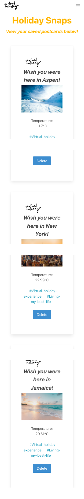
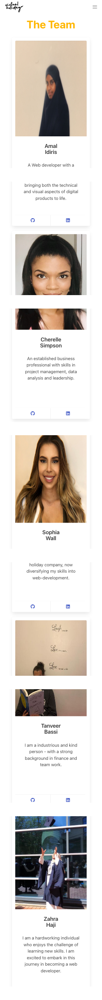

# virtual_holiday

This interactive app allows the user to experience a virtual holiday abroad. Begin by selecting a holiday type and be transported away to a new destination. Everything the user needs to recreate the holiday feeling virtually is included - from the scenery and atmospheric music, to a waiter who offers a snack and tells bad jokes!

Please click here to view our [deployed GitHub URL](https://c-sim.github.io/virtual-holiday/) and enjoy a holiday experience of your own!

Our [slide deck](https://docs.google.com/presentation/d/1hn8X5MmWIc6nBWaWMmlve2kIOyq5lL6oKKpnApON138/edit#slide=id.p) will help bring the processes we used to develop the project to life.

## User Story

```md
AS A person with limited resources available to escape reality
I WANT to be able to recreate a holiday atmosphere from the comfort of my own home
SO THAT I can manifest the relaxing holiday feeling
```

## The Virtual Holiday Experience

When the user arrives on the page, they are presented with a home-page that resembles an airport departure lounge. The user is asked to select a holiday type out of three options: Beach Holiday, City Break or a Ski Trip.

On selection of a holiday type, a video of a corresponding location is shown and themed music begins to play automatically. This gives the feeling that you have just been transported into a new destination.

The live temperature for the location renders. Why not set your home's thermostat to match this temperature?

At the restaurant, the local waiter will offer you a snack to eat and they will tell you a joke! Sit back and enjoy the view and let the ambience whisk your worries away.

Once your video and song has ended, or once you are ready to try a new experience, don't forget to save a holiday snap! This saves the unique iD of your holiday into local storage. Head over to the 'holiday snaps' page to view the postcard for your holiday, complete with the name of the destination, the image of the destination and the temperature of the holiday.

When you are ready, why not try another holiday type!

## Tools

We began by creating a wireframe of our project, in order to plan the layout and ensure we were all following the same direction:

<details>
<summary>Wireframe</summary>



</details>
</br>

The architectural diagram explains the interaction between the users' device, the web APIS and local storage:

<details>
<summary>Architectural Diagram</summary>



</details>
</br>

## Technologies

This project implements a variety of technologies:

<details>
<summary>HTML & CSS</summary>
- Video
- Audio
- Bulma frameworks
- Media queries
- Variables
- Responsiveness
- FontAwesome
</details>

<details>
<summary>JavaScript</summary>
  - Event Listeners
  - Template Strings
  - Conditional Statements
</details>

<details>
<summary>Plug-Ins</summary>
  - Typewriter
  - Unique IDs
</details>

<details>
<summary>Web APIs</summary>
  - Document Object Model
  - Local Storage
  - SnacksAPI, WeatherAPI & PapaJokeAPI
</details>

<details>
<summary>Third Party APIs</summary>
  - jQuery
  - OneCall Weather
  - Rapid API
  - FontAwesome
</details>

<details>
<summary>Server-side APIs</summary>
  - Fetch
</details>

<details>
<summary>GitHub Pages & Projects</summary>
  - Kanban board
  - Tickets
  - Assignees
</details>
</br>

## Screenshots

Please see the various screenshots of the different pages in both desktop and mobile viewport below:

### Desktop viewport

<details>
<summary>Landing Page</summary>


</details>

<details>
<summary>Experience Page</summary>



</details>

<details>
<summary>Holiday Snaps Page</summary>



</details>

<details>
<summary>About Us Page</summary>



</details>

<details>
<summary>Modal</summary>



</details>
</br>

### Mobile viewport

<details>
<summary>Landing Page</summary>



</details>

<details>
<summary>Experience Page</summary>



</details>

<details>
<summary>Holiday Snaps Page</summary>



</details>

<details>
<summary>About Us Page</summary>



</details>

</br>

## Development

As our time spent on the project progressed and we came up with more creative ideas, we made a variety of changes to the appearance and functionality of the webpage.

Below is the very first appearance of our website. The css had not yet been implemented and our background image was a temporary low quality version. It is very rewarding to compare our beginning steps to our final version just to see how much our webpage has improved!

<details>
<summary>First webpage appearance</summary>


</details>

</br>

## Acceptance Criteria

```md
GIVEN I am using the virtual holiday app to create a holiday scene
WHEN I select a holiday type
THEN the relevant components related to that holiday type manifest on the page
WHEN I look at the scenery
THEN I am presented with imagery from the holiday destination type
WHEN I listen to the playlist
THEN the music is relevant to the destination type
WHEN I want to set my thermostat to the temperature of the destination
THEN the temperature is displayed for me to match
WHEN I want to feel like I'm enjoying some down time in the destination
THEN a waiter will offer me a snack and a joke
WHEN I click on the holiday snap button
THEN all of my holiday details will be saved as a postcard
```

## Conclusion

The virtual holiday project gives the user a unique holiday experience. This webpage utilises 3 Web APIs to render weather data for a particular location, a snack choice and a joke.

The location, weather data and a corresponding image are then saved into local storage and rendered in the form of a virtual postcard.

To conclude, this has been a challenging yet enjoyable project to complete. We believe this project meets the brief that we set out to create and we have developed our coding skills and knowledge.

- Amal, Cherelle, Sophia, Tanveer and Zahra!
